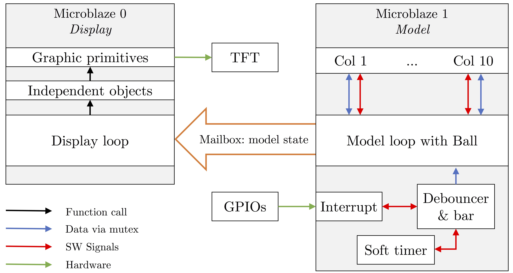
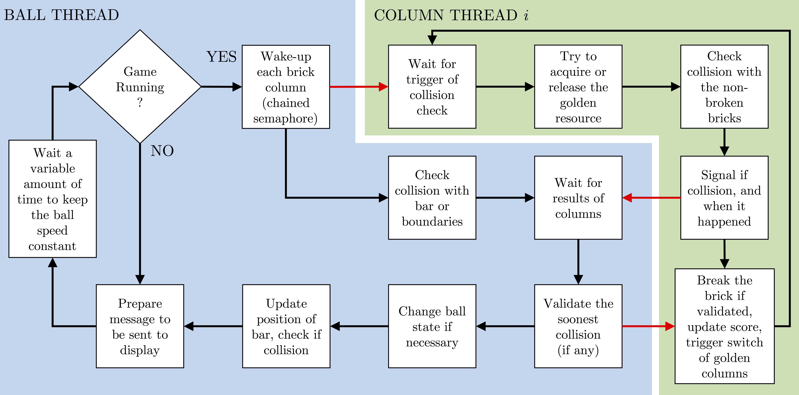

# Embedded Bricks Breaker

A distributed brick breaker game for an embedded Xilinx Zynq-7000 SoC. The application runs on two Microblaze processors on top of the Xilinx Micro-kernel and makes use of the power of programmable logic with customisable hardware timers, GPIO interfaces and a TFT controller.

This well-thought architecture allows high display FPS as well as an easier communication with the hardware for computationally-intensive tasks, e.g. involving machine learning or signal processing.

Next step: implementing a simple (deep) Q-learning algorithm on the hardware side for online reinforcement learning. Extend the game to multiplayer with two concurrent bars.

	

	

